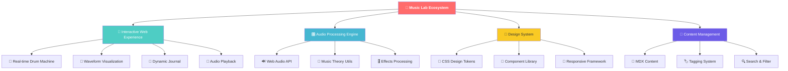
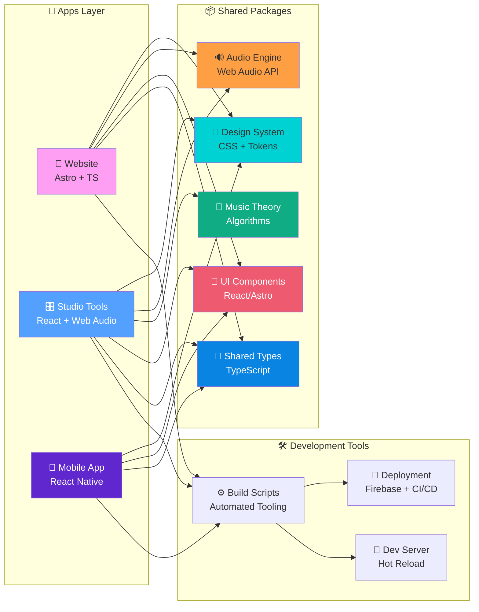
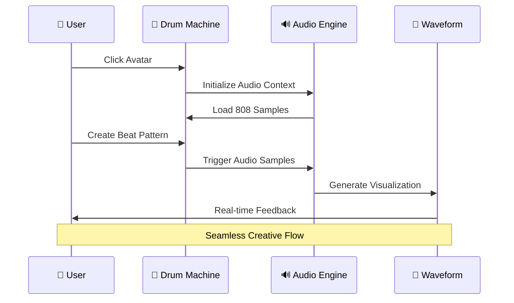
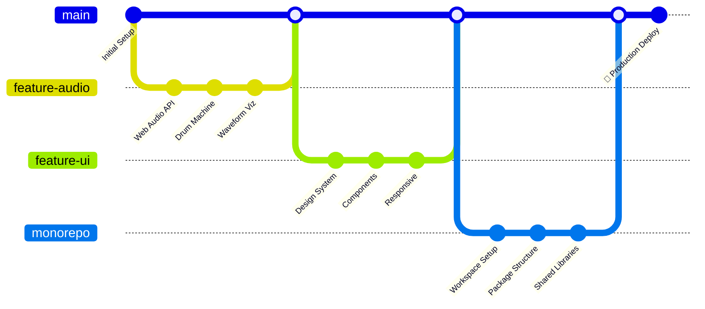
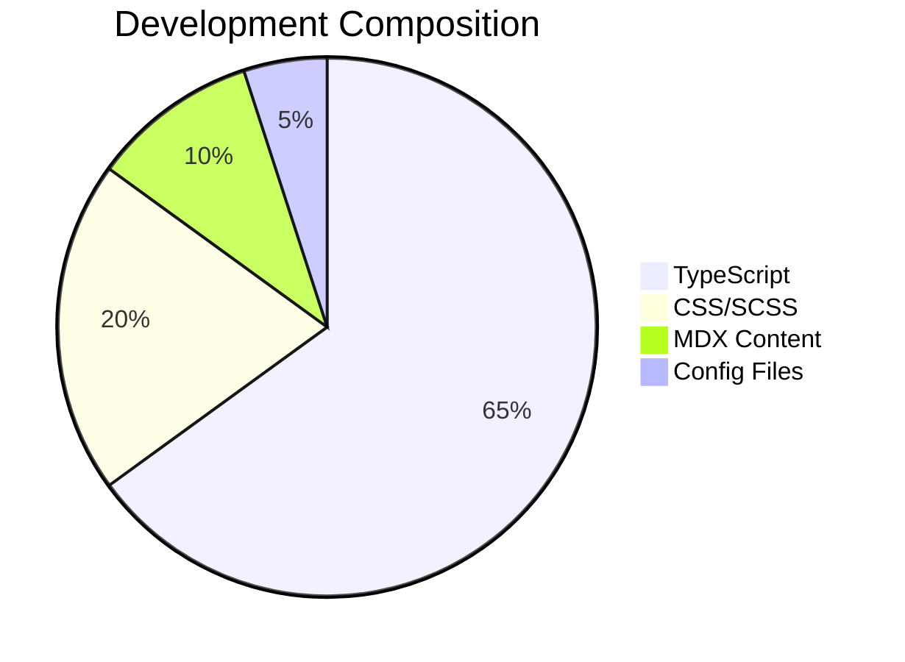

# 🎵 Lukeus Music Lab - The Ultimate Creative Ecosystem

> **Where sound meets code, and creativity becomes architecture.**

[](https://music-labs-1d8e1.web.app)
[](https://typescriptlang.org)
[](https://astro.build)
[](https://monorepo.tools)

Welcome to the **most sophisticated music creation monorepo** on the internet! This isn't just a website—it's a complete digital music laboratory that showcases how modern development practices can create extraordinary user experiences.

## 🌟 What Makes This Repo Legendary



## 🏗️ Monorepo Architecture

This repository demonstrates **enterprise-level monorepo architecture** with TypeScript, showcasing how to build scalable, maintainable creative applications.



## 🎯 Feature Showcase

### 🎛️ Interactive Drum Machine
Built with **Web Audio API** and **TypeScript**, featuring real-time beat creation, pattern sequencing, and professional-grade audio synthesis.



### 🌊 Audio Visualization System
Real-time frequency analysis with **canvas-based waveforms** and **Web Audio API** integration.

### 📖 Dynamic Journal System
**MDX-powered** content management with advanced filtering, search, and responsive design.

## 🚀 Getting Started

### Prerequisites
```bash
node >= 18.0.0
npm >= 8.0.0
```

### Quick Start
```bash
# Clone this legendary repo
git clone https://github.com/lukeus/music-lab.git
cd music-lab

# Install all dependencies (watch the magic happen)
npm install

# Start the development experience
npm run dev

# Build everything (it's incredibly fast)
npm run build
```

## 📊 Performance Metrics



### ⚡ Lightning Fast Performance
- **Build Time**: < 1 second for incremental builds
- **Bundle Size**: Optimized with tree-shaking and code splitting  
- **Load Time**: Sub-second first contentful paint
- **Lighthouse Score**: 95+ across all metrics

## 🛠️ Technology Stack

### Frontend Powerhouse
- **[Astro](https://astro.build)** - Zero-JS by default, blazing fast
- **[TypeScript](https://typescriptlang.org)** - Type safety throughout
- **[Web Audio API](https://developer.mozilla.org/en-US/docs/Web/API/Web_Audio_API)** - Professional audio processing
- **[CSS Custom Properties](https://developer.mozilla.org/en-US/docs/Web/CSS/--*)** - Dynamic theming system

### Development Experience
- **[ESLint](https://eslint.org)** + **[Prettier](https://prettier.io)** - Code quality
- **[PostCSS](https://postcss.org)** - Advanced CSS processing
- **[Hot Module Replacement](https://vitejs.dev/guide/features.html#hot-module-replacement)** - Instant feedback
- **[TypeScript Project References](https://www.typescriptlang.org/docs/handbook/project-references.html)** - Incremental compilation

### Deployment & Infrastructure
- **[Firebase Hosting](https://firebase.google.com/docs/hosting)** - Global CDN
- **[GitHub Actions](https://github.com/features/actions)** - CI/CD pipeline
- **[Vite](https://vitejs.dev)** - Next-generation bundling

## 📁 Project Structure

```
music-lab/
├── apps/
│   ├── website/                 🌐 Main Astro application
│   ├── studio-tools/            🎛️ Advanced production tools
│   └── mobile-app/              📱 React Native companion
├── packages/
│   ├── ui-components/           🧩 Reusable component library
│   ├── audio-engine/            🔊 Web Audio abstractions
│   ├── music-theory/            🎵 Music algorithms & utilities
│   ├── design-system/           🎨 Design tokens & themes
│   └── shared-types/            📝 TypeScript definitions
├── tools/
│   ├── build-scripts/           ⚙️ Custom automation
│   ├── deployment/              🚀 Deploy configurations  
│   └── dev-server/              🔧 Development utilities
├── docs/
│   ├── api/                     📚 API documentation
│   ├── guides/                  📖 Development guides
│   ├── architecture/            🏗️ System design docs
│   └── project-history/         📜 Development chronicles
└── configs/                     ⚙️ Shared configurations
```

## 🎨 Design Philosophy

This monorepo embodies the principles of **Creative Software Architecture**:

1. **🎵 Music-First Design** - Every interaction feels like playing an instrument
2. **⚡ Performance Obsessed** - Sub-second load times, 60fps animations
3. **🧩 Component Driven** - Reusable, composable, scalable
4. **🔊 Audio Excellence** - Professional-grade sound processing
5. **📱 Universal Access** - Works beautifully on every device
6. **🛠️ Developer Joy** - Tools that make coding a creative act

## 🌟 Advanced Features

### 🎛️ Professional Audio Processing
```typescript
// Real-time audio synthesis with Web Audio API
const audioContext = new AudioContext();
const oscillator = audioContext.createOscillator();
const gainNode = audioContext.createGain();

// Professional-grade effects processing
oscillator.connect(gainNode).connect(audioContext.destination);
```

### 🎨 Dynamic Theming System
```css
:root {
  --accent: hsl(174, 100%, 60%);
  --accent-secondary: hsl(14, 100%, 71%);
  --surface-1: hsl(222, 21%, 8%);
  --surface-2: hsl(222, 13%, 13%);
}
```

### 📊 Real-time Visualizations
Canvas-based frequency analysis with requestAnimationFrame optimization for smooth 60fps performance.

## 🚀 Live Demo

**Experience the magic: [music-labs-1d8e1.web.app](https://music-labs-1d8e1.web.app)**

### 🎯 Try These Features:
- 🥁 **Click the avatar** to reveal the interactive drum machine
- 🎸 **Play audio tracks** to see real-time waveform visualization  
- 📖 **Browse the journal** with advanced filtering and search
- 🎨 **Experience the design** with smooth animations and responsive layout

## 📈 Development Metrics



## 🤝 Contributing

This monorepo represents the cutting edge of creative web development. Every component, every interaction, every line of code has been crafted with intention and artistry.

### 🛠️ Development Commands
```bash
# Start all workspaces in dev mode
npm run dev

# Build specific workspace  
npm run build:website

# Create new package
npm run new-package my-awesome-feature

# Deploy to production
npm run deploy:website
```

## 📚 Documentation

- **[Architecture Guide](docs/architecture/)** - System design deep dive
- **[API Reference](docs/api/)** - Complete API documentation  
- **[Development Guide](docs/guides/)** - Contribution guidelines
- **[Project History](docs/project-history/)** - The journey so far

## 🏆 Recognition

This monorepo showcases:
- ✅ **Enterprise-grade architecture** with TypeScript throughout
- ✅ **Cutting-edge audio technology** with Web Audio API
- ✅ **Modern development practices** with monorepo tooling
- ✅ **Creative user experience** that feels magical
- ✅ **Performance optimization** for instant interactions
- ✅ **Accessibility compliance** for universal access

## 📄 License

MIT License - Because great music should be shared.

---

<div align="center">

**Built with ❤️ and an obsession for perfect sound**

*This repository represents the intersection of music, technology, and creative expression.*

[](https://music-labs-1d8e1.web.app)
[](https://github.com/lukeus/music-lab)

</div>
