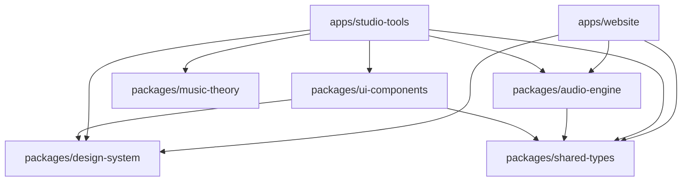

# 🏗️ Architecture Overview

## System Design

The Lukeus Music Lab follows a sophisticated monorepo architecture designed for scalability, maintainability, and creative expression.

## Core Principles

1. **Music-First Architecture** - Every system decision optimizes for audio performance
2. **Component Driven Design** - Reusable, composable, scalable components
3. **TypeScript Throughout** - Type safety from packages to production
4. **Performance Obsessed** - Sub-second load times, 60fps interactions
5. **Developer Experience** - Tools that make coding a creative act

## Technology Decisions

### Frontend Stack
- **Astro**: Zero-JS by default, optimal performance
- **TypeScript**: Complete type safety across the monorepo
- **Web Audio API**: Professional-grade audio processing
- **CSS Custom Properties**: Dynamic theming system

### Monorepo Architecture
- **npm Workspaces**: Dependency management and linking
- **TypeScript Project References**: Incremental compilation
- **Shared Packages**: Reusable code across applications
- **Build Optimization**: Parallel builds and caching

### Audio Processing
- **Web Audio API**: Real-time audio synthesis and effects
- **Canvas Visualization**: 60fps waveform rendering
- **Audio Context Management**: Shared audio resources
- **Professional Samples**: 808 drum machine sounds

## Package Dependency Graph

For detailed implementation guides, see the [guides](../guides/) directory.
